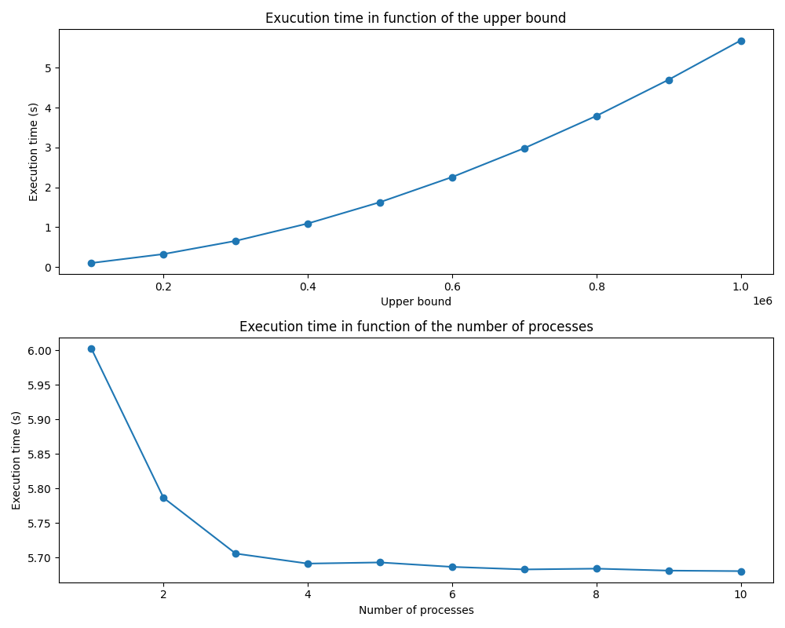

# Prime Number Finder

Prime Number Finder is a program designed to find and print all prime numbers within a given range. It utilizes parallel processing to optimize performance.

## Quick Start

### Installation

1. Clone the repository:
    ```shell
    git clone https://github.com/RolletQuentin/prime_number_finder
    cd prime_number_finder
    ```

2. Build the program:
    ```shell
    make
    ```

### Usage

Execute the program with the following command:
```shell
./bin/main <max_number> <pool_size>
```

- `<max_number>`: The upper limit of the range for prime number search.
- `<pool_size>`: The number of child processes to use for parallel computation.

For example, to find prime numbers up to 10,000 using 4 child processes:
```shell
./bin/main 10000 4
```

## How It Works

### Is Prime?

The program employs the trial division method to determine whether a number is prime. It utilizes the following algorithm:

```c
int isPrime(int n) {
    if (n <= 1) {
        return 0;
    }
    if (n <= 3) {
        return 1;
    }
    if (n % 2 == 0 || n % 3 == 0) {
        return 0;
    }
    for (int i = 5; i * i <= n; i += 6) {
        if (n % i == 0 || n % (i + 2) == 0) {
            return 0;
        }
    }
    return 1;
}
```

If the number is 2 or 3, it is a prime number. Then we check if the number can be divided by 2 or 3. After that, we can use the fact that every prime number greater than 3 can be expressed in the form 6k ± 1, where k is an integer. By checking only numbers of this form after verifying divisibility by 2 and 3 separately, the algorithm efficiently identifies prime numbers without unnecessarily checking divisibility by even or divisible-by-3 numbers.

To sum up, this algorithm efficiently identifies prime numbers by skipping unnecessary divisibility checks.

### Pool of Processes

The program utilizes a master-slave architecture, with one master process and several child processes. The master assigns a range of numbers to each child process for prime number computation. Each child process communicates its findings back to the master process via pipes.

To optimize performance, the master process divides the range of numbers such that the computation time for each child process is balanced.

## Benchmark

You can use the provided benchmark script to assess the performance of the Prime Number Finder and observe the impact of varying the number of processes. Below is a sample benchmark graph showcasing the program's performance:



To run the benchmark on your computer, follow these steps:

1. Set up a virtual environment and install dependencies:
    ```shell
    python3 -m venv venv
    source venv/bin/activate
    pip install matplotlib
    ```

2. Execute the benchmark script:
    ```shell
    python3 benchmark.py
    ```

You are free to adjust the benchmark parameters according to your needs. In the benchmark.py file, modify the following variables to specify the upper bounds and the number of processes to test:

```python
# List of upper bounds and number of processes to test
upper_bounds = [100000, 200000, 300000, 400000,
                500000, 600000, 700000, 800000, 900000, 1000000]
num_processes = [1, 2, 3, 4, 5, 6, 7, 8, 9, 10]
```

Feel free to experiment with different values to assess the program's scalability and performance characteristics under various conditions.